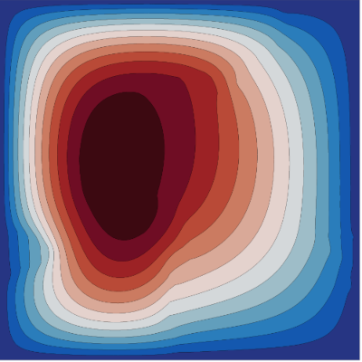
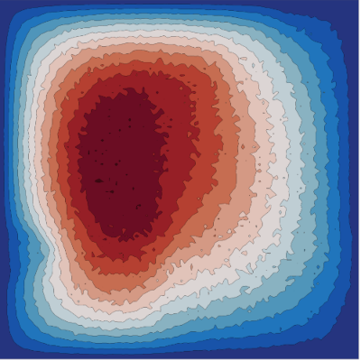
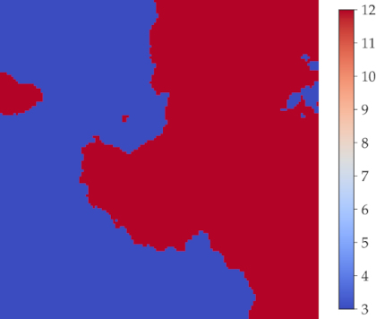
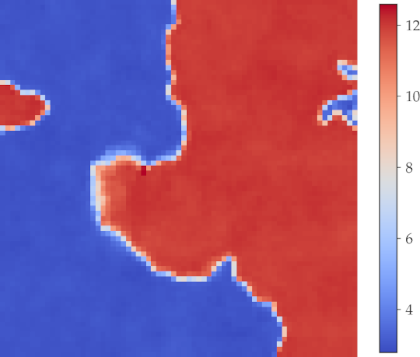

# [NeurIPS 2021] Galerkin Transformer: linear attention without softmax
[](./LICENSE)
[](https://www.python.org/downloads/release/python-370/)
[](https://pytorch.org/)
[](https://arxiv.org/abs/2105.14995)
[](https://open.vscode.dev/scaomath/galerkin-transformer)


# Summary
- A non-numerical analyst oriented explanation on Toward Data Science about the [Galerkin Transformer](https://towardsdatascience.com/galerkin-transformer-a-one-shot-experiment-at-neurips-2021-96efcbaefd3e)
-  [The post on my blog](https://scaomath.github.io/blog/galerkin-transformer/), has a bit more details on the math of how to bridge a nonlinear operator's approximation capacity with a linear operator (Petrov-Galerkin projection).

- For how to train our models please refer to [the training instructions under the `/examples` folder](./examples/).

- If just wanting to see what is it like for the models to perform on the unseen test set, please refer to [evaluation](#evaluation-notebooks).

## Introduction 
The new attention operator (for the encoder) is simply `Q(K^TV)`, or the quadratic complexity one `(QK^T)V`. 
- No softmax, or the approximation thereof, at all.
- Whichever two latent representations doing `matmul` get the layer normalization, similar to Gram-Schmidt process where we have to divide the basis's norm squared. `Q, K` get layer normalized in the Fourier-type attention (every position attends with every other), as for `K, V` in the Galerkin-type attention (every basis attends with every other basis). No layer normalization is applied afterward. 
- Some other components are tweaked according to our Hilbertian interpretation of attention.

Overall this is called a scale-preserving simple attention. For the full operator learner, the feature extractor is a simple linear layer or an interpolation-based CNN, the decoder is the spectral convolution real parameter re-implementation from the best operator learner to-date Fourier Neural Operator (FNO) in [*Li et al 2020*](https://github.com/zongyi-li/fourier_neural_operator) if the target is smooth, or just a pointwise FFN if otherwise. The resulting network is extremely powerful in learning PDE-related operators (energy decay, inverse coefficient identification).

## Hilbertian framework to analyze linear attention
Even though everyone is Transformer'ing, the mathematics behind the attention mechanism is not well understood. We have also shown that the Galerkin-type attention (a linear attention without softmax) has an approximation capacity on par with a Petrov-Galerkin projection under a Hilbertian setup. We use a method commonly known as ''mixed method'' in the finite element analysis community that is used to solve fluid/electromagnetics problems. Unlike finite element methods, in an attention-based operator learner the approximation is not discretization-tied, in that:

1. The latent representation is interpreted "column-wise" (each column represents a basis), opposed to the conventional "row-wise"/ "position-wise"/"word-wise" interpretation of attention in NLP.
2. The dimensions of the approximation spaces are not tied to the geometry as in the traditional finite element analysis (or finite difference, spectral methods, radial basis, etc.);
3. The approximation spaces are being dynamically updated by the nonlinear universal approximator due to the presence of the positional encodings, which determines the topology of the approximation space.

For details please refer to: [https://arxiv.org/abs/2105.14995](https://arxiv.org/abs/2105.14995)
```bibtex
@Misc{Cao:2021transformer,
  author        = {Shuhao Cao},
  title         = {Choose a Transformer: Fourier or Galerkin},
  year          = {2021},
  archiveprefix = {arXiv},
  eprint        = {2105.14995},
  primaryclass  = {cs.CL},
  url           = {https://arxiv.org/abs/2105.14995},
}
```


# Install

## Requirements
(Updated Jun 17 2021) `PyTorch` requirement updated to `1.9.0` as the introduction of the [`batch_first` argument](https://github.com/pytorch/pytorch/pull/55285) will conform with our pipeline.

This package can be cloned locally and used with the following requirements:

```bash
git clone https://github.com/scaomath/galerkin-transformer.git
cd galerkin-transformer
python3 -m pip install -r requirements.txt
```

```sh
seaborn==0.11.1
torchinfo==0.0.8
numpy==1.20.2
torch==1.9.0
plotly==4.14.3
scipy==1.6.2
psutil==5.8.0
matplotlib==3.3.4
tqdm==4.56.0
PyYAML==5.4.1
```

If interactive mode is to be used, please install
```
jupyterthemes==0.20.0
ipython==7.23.1
```

## Installing using pip

This package can be installed using pip.

```bash
python3 -m pip install galerkin-transformer
```

Example usage of the Simple Fourier/Galerkin Transformer encoder layers:

```python
from galerkin_transformer.model import *

encoder_layer = FourierTransformerEncoderLayer(
                 d_model=128,
                 pos_dim=1,
                 n_head=4,
                 dim_feedforward=512,
                 attention_type='galerkin',
                 layer_norm=False,
                 attn_norm=True,
                 norm_type='layer',
                 dropout=0.05)
encoder_layers = nn.ModuleList([copy.deepcopy(encoder_layer) for _ in range(6)])
x = torch.randn(8, 8192, 128) # embedding
pos = torch.arange(0, 8192).unsqueeze(-1) # Euclidean coordinates
pos = pos.repeat(8, 1, 1)
for layer in encoder_layers:
    x = layer(x, pos)
```

# Data
The data is courtesy of [Zongyi Li (Caltech)](https://github.com/zongyi-li/fourier_neural_operator)  under the MIT license. Download the following data from [here](https://drive.google.com/drive/folders/1UnbQh2WWc6knEHbLn-ZaXrKUZhp7pjt-?usp=sharing):
>`burgers_data_R10.mat`
<br>`piececonst_r421_N1024_smooth1.mat`
<br>`piececonst_r421_N1024_smooth2.mat`.

The repo has a semi env variable `$DATA_PATH` set in [`utils_ft.py`](./libs/utils_ft.py), if you have a global system environ variable name `DATA_PATH`, then please put the data in that folder. Otherwise, please unzip the Burgers and Darcy flow problem files to the `./data` folder. 

# Examples
All examples are learning PDE-related operators. The setting can be found in [`config.yml`](./config.yml). To fully reproducing our result, please refer to [the training scripts](./examples/README.md) for all the possible args.

By default the evaluation is performed on the last 100 samples in the test dataset like the code in [FNO repo](https://github.com/zongyi-li/fourier_neural_operator). All trainers are using the [`1cycle` scheduler](https://arxiv.org/abs/1708.07120) in [PyTorch](https://pytorch.org/docs/master/generated/torch.optim.lr_scheduler.OneCycleLR.html) for 100 epochs. Every example has a `--seed $SEED` argument and the default seed is 1127802. Again if you have a system wide env variable named `SEED`, the code will use that seed instead. 

### A caveat for Darcy problems
Since [`nn.functional.interpolate`](https://pytorch.org/docs/master/generated/torch.nn.functional.interpolate.html) is used in Darcy examples, a fixed seed may still yield different results each training cycle on GPU according to PyTorch documents, but we have verified that the variance is negligible. Some example set-ups are as follows.

## Example 1: Burgers equation


The baseline benchmark [`ex1_burgers.py`](./examples/): evaluation relative error is about `1e-3` with a simple pointwise forward expansion feature extractor. The input is the initial condition of a viscous Burgers' equation on a discrete grid, the output is an approximation to the solution marched to time $1$. The initial data are generating using a GRF and the data in the validation set are not in the train set.

Default benchmark on a 2048 grid using a Fourier Transformer, with 4 Fourier-type attention encoder layers as the encoder and 2 spectral convolution layers from [Li et al 2020](https://github.com/zongyi-li/fourier_neural_operator) as the decoder (to reduce the overfit we decrease the `dmodel` of the spectral conv from the original 64 to 48):
```bash
python ex1_burgers.py
```
For more choices of arguments, please refer to [Example 1 in models](./examples/README.md#Example-1-viscous-Burgers).

## Example 2 Interface Darcy's flow


The baseline benchmark [`ex2_darcy.py`](./examples/): evaluation relative error is about `8e-3` to `1e-2` with a 3-level interpolation-based CNN (CiNN) feature extractor. The coarse grid latent representation is sent to attention layers The operator input is discontinuous coefficient with a random interface sampled at a discrete grid, the output is a finite difference approximation to the solution restricted to the sampled grid from a fine `421x421` grid. The coefficient in the validation set are not in the train set.

Default benchmark on a 141x141 grid using the Galerkin Transformer, 6 Galerkin-type attention layers with `d_model=128` and `nhead=4` as the encoder, and 2 spectral conv layers from [Li et al 2020](https://github.com/zongyi-li/fourier_neural_operator) as the decoder. There is a small dropout `5e-2` in the attention layer as well as in the feature extraction layer:
```bash
python ex2_darcy.py
```
For a smaller memory GPU or CPU, please use the 85x85 grid fine, 29x29 coarse grid setting:
```bash
python ex2_darcy.py --subsample-attn 15 --subsample-nodes 5 --attention-type 'galerkin' --xavier-init 0.01 --diagonal-weight 0.01
```
For more choices of arguments, please refer to [Example 2 in models](./examples/README.md#Example-2-interface-Darcy).

## Example 3 Inverse coefficient identification for interface Darcy's flow

Example 3 is an inverse interface coefficient identification for Darcy flow based on the same dataset used in Example 2. However, in this example, the input and the target are reversed, i.e., the target is the interface coefficient with a random geometry, and the input is the finite difference approximation to the PDE problem, together with an optional noise added to the input to simulate measurement errors. Due to a limit of interpolation operator having no approximation property to nonsmooth functions, the coefficient cannot be resolved at the resolution, the target is sampled at a lower resolution than the input. 


**Evaluation input data with no noise**



**Evaluation input data with 10% noise fed to the model**



**True target (diffusion coefficient with a sharp interface)**



**Reconstructed target**



The baseline benchmark [`ex3_darcy_inv.py`](./examples/):  Evaluation relative error is about `1.5e-2` to `2e-2` without noise, `2.5e-2` with 1% noise, and `7e-2` to `8e-2` with 10% noise in both train and test. If the training data is clean, then adding noise would not generalize well in the test. It is recommended to training with a reasonable amount of noise. 

Default benchmark is on a 141x141 fine grid input and a 36x36 coarse grid coefficient output. The model is the Galerkin Transformer with 6 stacked Galerkin-type attention layers (`d_model=192`, `nhead=4`) with a simple pointwise feed-forward neural network to map the attention output back the desired dimension. There is a small dropout in every key components of the network (`5e-2`). The noise is added to the normalized input, so 0.01 noise means 1%, and 0.1 means 10%. By default there is 1% noise added.
```bash
python ex3_darcy_inv.py --noise 0.01
```
For more choices of arguments, please refer to [Example 3 in models](./examples/README.md#Example-3-inverse-Darcy).

# Evaluation notebooks
Please download the pretrained model's `.pt` files from Releases and put them in the `./models` folder.
- [Example 1](./eval/ex1_burgers_eval.ipynb)
- [Example 2](./eval/ex2_darcy_eval.ipynb)
- [Example 3](./eval/ex3_darcy_inv_eval.ipynb)


# Memory and speed profiling using `autograd.profiler`
Using CUDA, Fourier Transformer features an over 40% reduction in `self_cuda_memory_usage` versus the standard softmax normalized transformers, and Galerkin Transformer's the backpropagation speed has a 20% to 100% increase over the standard linearized transformers. If no GPU is available please enable the `--no-cuda` switch.

Example 1 memory profile of a model with 96 hidden dimension with an input sequence length 8192. Compare the memory usage of the Fourier transformer with the one with softmax
```bash
python ex1_memory_profile.py --batch-size 4 --seq-len 8192 --dmodel 96 --attention-type 'softmax' 'fourier'
```
Compare the backpropagation time usage of the Galerkin transformer versus the same net, but with Galerkin-type simple attention replaced by the standard linearized attention. 
```bash
python ex1_memory_profile.py --batch-size 4 --seq-len 8192 --dmodel 96 --num-iter 100 --attention-type 'linear' 'galerkin'
```

Encoder layer wrapper profiling: profile a wrapper with 10 layers of encoder in a model for operators defined for functions whose domain is isomorphic to a 2D Euclidean space. Example:
```bash
python encoder_memory_profile.py --batch-size 4 --dmodel 128 --num-layers 6 -ndim 2
```
Please refer to [the memory profile section in models](./examples/README.md#Memory-profiling) for more detailed profiling in each example.


# License
This software is distributed with the MIT license which translates roughly that you can use it however you want and for whatever reason you want. All the
information regarding support, copyright and the license can be found in the [LICENSE](./LICENSE) file.

# Acknowledgement
The hardware to perform this work is provided by Andromeda Saving Fund. This work was supported in part by the National Science Foundation under grants DMS-1913080 and no additional revenues are related to this work. We would like to thank [Dr. Long Chen (Univ of California Irvine)](https://github.com/lyc102) for the inspiration of and encouragement on the initial conceiving of this paper, as well as numerous constructive advices on revising this paper, not mentioning his persistent dedication of [making publicly available tutorials](https://lyc102.github.io/ifem/) on writing [beautiful vectorized code](https://github.com/lyc102/ifem). We would like to thank Dr. Ari Stern (Washington Univ in St. Louis) for the help on the relocation during the COVID-19 pandemic. We would like to thank Dr. Ruchi Guo (Univ of California Irvine) and Dr. Yuanzhe Xi (Emory) for the invaluable feedbacks on the choice of the numerical experiments. We would like to thank the Kaggle community, including but not limited to Jean-François Puget ([Uncle CPMP@Kaggle](https://www.kaggle.com/cpmpml)) for sharing a simple [Graph Transformer](https://www.kaggle.com/cpmpml/graph-transfomer) in Tensorflow, Murakami Akira ([mrkmakr@Kaggle](https://www.kaggle.com/mrkmakr)) for sharing a [Graph Transformer with a CNN feature extractor in Tensorflow](https://www.kaggle.com/mrkmakr/covid-ae-pretrain-gnn-attn-cnn), and Cher Keng Heng ([hengck23@Kaggle](https://www.kaggle.com/hengck23)) for sharing a [Graph Transformer in PyTorch](https://www.kaggle.com/c/stanford-covid-vaccine/discussion/183518).
We would like to thank daslab@Stanford, OpenVaccine, and Eterna for hosting the COVID-19 mRNA Vaccine competition and Deng Lab (Univ of Georgia) for collaborating in this competition. We would like to thank CHAMPS (Chemistry and Mathematics in Phase Space) for hosting the J-coupling quantum chemistry competition and Corey Levinson ([returnofsputnik@Kaggle](https://www.kaggle.com/returnofsputnik), Eligo Energy, LLC) for collaborating in this competition. We would like to thank [Zongyi Li (Caltech)](https://github.com/zongyi-li) for sharing some early dev code in the updated PyTorch `torch.fft` interface. We would like to thank Ziteng Pang (Univ of Michigan) and Tianyang Lin (Fudan Univ) to update us with various references on Transformers. We would like to thank [Joel Schlosser](https://github.com/jbschlosser) to incorporate our change to the PyTorch `transformer` submodule to simplify our testing pipeline. We would be grateful to the PyTorch community for selflessly code sharing, including Phil Wang([lucidrains@github](https://github.com/lucidrains)) and [Harvard NLP group Klein et al. (2017)](https://nlp.seas.harvard.edu/2018/04/03/attention.html). We would like to thank the chebfun Driscoll et al. (2014) for integrating powerful tools into a simple interface to solve PDEs. We would like to thank [Dr. Yannic Kilcher](https://www.youtube.com/c/YannicKilcher/about) and [Dr. Hung-yi Lee (National Taiwan Univ)](https://www.youtube.com/c/HungyiLeeNTU) for frequently covering the newest research on Transformers in video formats. We would also like to thank the Python community (Van Rossum and Drake (2009); Oliphant (2007)) for sharing and developing the tools that enabled this work, including Pytorch Paszke et al.(2017), NumPy Harris et al. (2020), SciPy Virtanen et al. (2020), Seaborn Waskom (2021), Plotly Inc. (2015), Matplotlib Hunter (2007), and the Python team for Visual Studio Code. For details please refer to the documents of every function that is not built from the ground up in our open-source software library.
